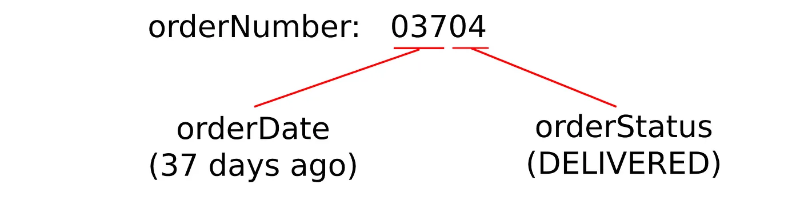

<figcaption>Photo by <a href="https://unsplash.com/@mbaumi?utm_source=medium&utm_medium=referral">Mika Baumeister</a> on <a href="https://unsplash.com/?utm_source=medium&utm_medium=referral">Unsplash</a></figcaption>

> This article is also published on [Medium](https://medium.com/@mehranmirkhan/a-trick-to-mock-apis-for-testing-f7154ca64c07)

# Introduction

I’ve always struggled with writing integration tests. Why? Because in writing integration tests, I try to mimic the environment in which my application is going to be deployed. This includes simulating databases, message brokers, and also other APIs. Simulating infrastructures (DBs and message brokers) is easy. You would just run a docker container. But what can be done about external business APIs?

<!-- end -->

# An Example API

Imagine we are writing multiple microservices and they depend on an API that provides information about orders. Every order has a structure like this:

```json
{
  "orderNumber": "5743982793",
  "orderDate": "2021-09-01",
  "orderStatus": "DELIVERED"
}
```

These microservices perform different actions based on different order details — For example, if the order status is “**DELIVERED**” we should write it to a database. If the status is something else, then we should check the orderDate and if it is ordered more than 5 days ago we should send this info to a message broker. You can imagine any other business requirements as you like.

Now the question is that how would you mock this API if you need it in your integration tests? The approach that comes to mind is to create a lot of sample orders in a database each with different details and then use each one in a test scenario — However, the problem with this approach is that it becomes exponentially harder to cover all the possibilities of the order details. What if the order has multiple status fields for example (like shipping status)?

# A Nice Idea

The idea that I want to propose is to encode the details into the identifier! In our example, the mocked order API would create a fake order on the fly with details that are based on the given order number:



In the above image, we are interpreting the first 3 digits to represent how many days ago the order was created; and we interpret the next 2 digits to represent the status of the order. Now when you write your test scenarios, you can test different possibilities of the orders by just providing specific order numbers. In this very simple example, you can produce 1000\*100 different order possibilities which would have been impossible if you wanted to create actual example orders to serve them in your mock service.
